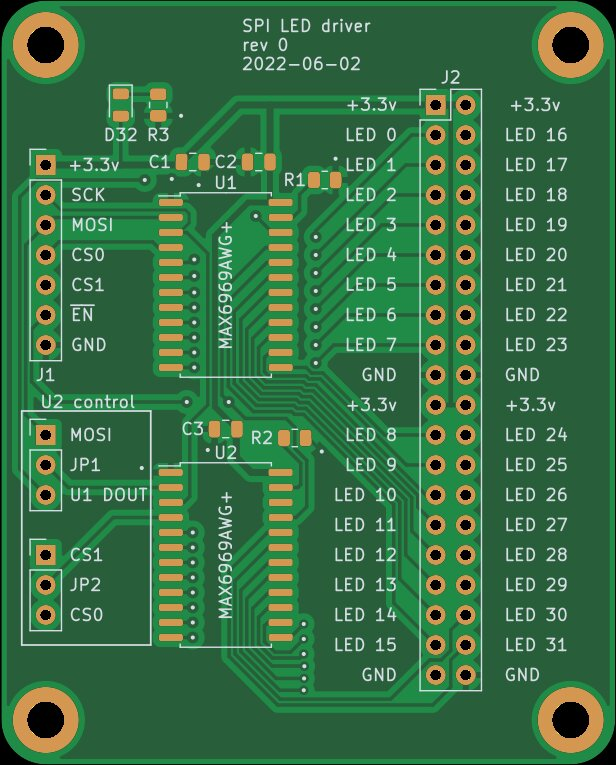
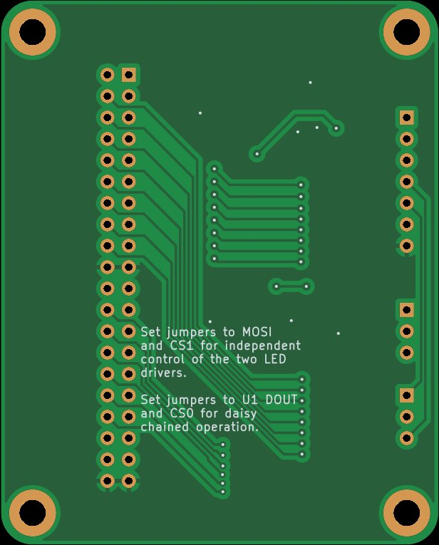

# LED Driver Breakout Board

## Small pcb to test the LED driver circuit

## Brief description:
Two MAX6969 LED driver chips are driven by SPI.

Open `index.html` in a browser for easy to navigate documentation and fabrication files.

## Status of the project:

Task | Status |
---------|--------------|
Schematic capture | &#9745;
PCB layout | &#9745;
Test build | &#9745;
Safe to order boards| &#9745;
Python test script | &#9745;