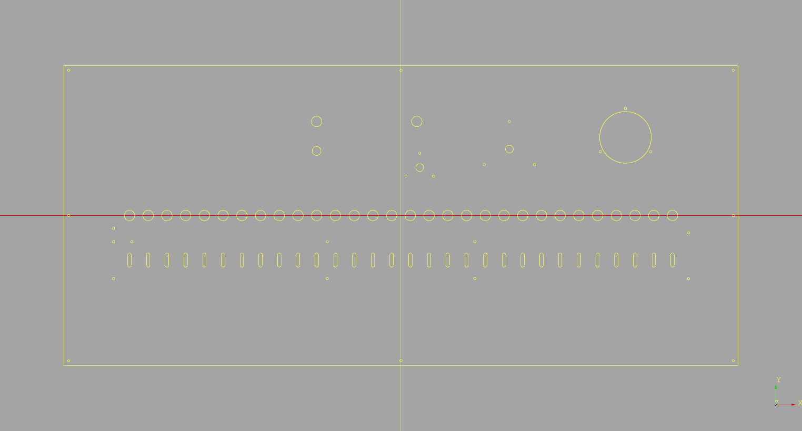

# CAD and Other Mechanical Design Files for the Obedience Box Hardware

## Current state:
- The basic panel is drawn according to the measurements from the actual device.
- It needs to be checked and tweaked as needed, but the basic elements are close to where they should be.
- The vernier dials and voltmeter might need some tweaking. In particular the big vernier, we're not sure exactly which one to use yet.
- There is no lettering in this version. This will be added later.

